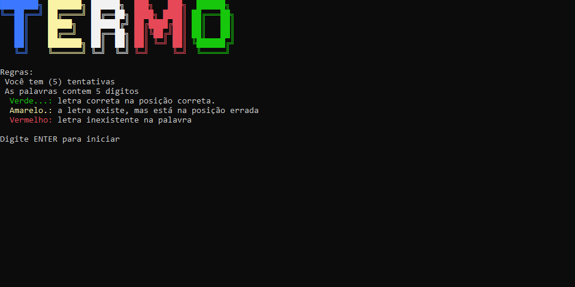

## Termo



O Termo é um jogo de adivinhação de palavras desenvolvido em C# (console), inspirado em jogos como Wordle.
O objetivo do jogador é descobrir uma palavra secreta de 5 letras em até 5 tentativas.

A cada tentativa, o sistema fornece feedback visual por cores, indicando o quão próximo o jogador está da resposta correta.

## 🧠 Como jogar
O sistema irá sortear uma palavra aleatória. Digite uma palavra de 5 letras, o jogo vai comparar letra por letra e te retornar um feedback com cores:

- 🟩 **Verde** → letra correta na posição correta
- 🟨 **Amarelo** → letra existe, mas em outra posição
- 🟥 **Vermelho** → letra não existe na palavra

## ⚙️ Funcionalidades

- **Sorteio de palavras**: O programa seleciona aleatoriamente uma palavra a cada nova partida.
- **Validação de entrada**: O sistema aceita apenas palavras com 5 letras e sem caracteres inválidos.
- **Comparação letra por letra**: Cada tentativa do jogador é comparada individualmente com a palavra secreta.
- **Feedback visual**: O resultado é exibido no console com cores que indicam acerto, posição incorreta ou erro.
- **Tela de vitória/derrota**: Exibe uma mensagem personalizada quando o jogador acerta a palavra ou esgota as tentativas.
- **Permite repetição**: O jogador pode iniciar novas partidas quantas vezes quiser.

## ▶️ Como utilizar o programa

1. Clone o repositório ou baixe o código em `.zip`.
2. Abra o terminal e navegue até a pasta raiz do projeto.
3. Execute o comando abaixo para restaurar as dependências:

    ```
    dotnet restore
    ```

4. Depois, execute o projeto com:

    ```
    dotnet run --project Termo.ConsoleApp
    ```
    

5. Após iniciar o programa, pressione **ENTER** para começar e digite uma palavra quando solicitado, acompanhando o feedback exibido no console.

## 📌 Requisitos

- .NET SDK 10.0


Site para fazer ASCII Art via texto:
link: https://patorjk.com/software/taag/

## 🎨 Elementos visuais

Para melhorar a experiência visual no console, o projeto utiliza banners em ASCII Art gerados com a ferramenta **TAAG – Text to ASCII Art Generator**.

🔗 https://patorjk.com/software/taag/

### 🅰️ Fontes utilizadas

- **TERMO** → `ANSI Shadow`  
- **VITÓRIA** → `Graceful`  
- **DERROTA** → `Graceful`  